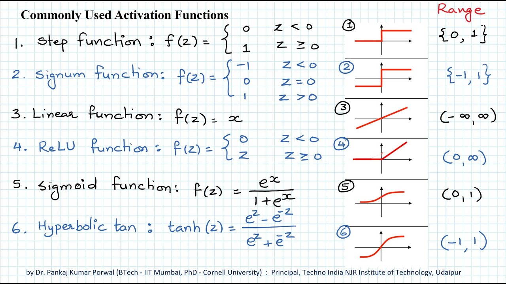

# Activation Function : 
    An Activation Function decides whether a neuron should be activated or not

   
  
  
  

# Evaluation : 

## ***Classification Models :***
    In order to assess the models' performance, it is necessary to apply the testing data to the models and compare the predictions with the actual targets using the following metrics:

- *Accuracy :* is defined as the percentage of correct predictions for the test data.

- *Precision :* is defined as the fraction of relevant examples (true positives) among all the examples which were predicted to belong in a certain class.
- *Recall :* is defined as the fraction of examples that were predicted to belong to a class with respect to all the examples that truly belong in the class.
- *F-score :* is a way of combining the precision and recall of the model, and it is defined as the harmonic mean of the model’s precision and recall.

## ***Regression Model :***

  
  
  

# loss function
    A loss function is a mathematical function that measures the difference between the predicted output and the actual output in a machine learning model. The goal of the loss function is to minimize the difference between the predicted output and the actual output, which is also known as the error or the loss. The loss function is an essential component of a machine learning model, as it is used to train the model by adjusting the model's parameters in response to the calculated loss.

- ***Categorical cross entropy Loos Function :*** it is a loss function used for classification tasks with multiple classes, and it is a measure of the difference between the true distribution of the classes and the predicted distribution of the classes. The output label is assigned a one-hot category encoding value in form of 0s and 1.

  
  
  

# optimizer
    An optimizer is an algorithm used to minimize the loss function by adjusting the parameters of a machine learning model. The optimizer is responsible for finding the set of model parameters that produces the minimum value of the loss function. There are several different types of optimizers, each with its own strengths and weaknesses. Some common optimizers used in machine learning include stochastic gradient descent (SGD), Adam, Adagrad, and RMSProp. The choice of optimizer depends on the specific problem being solved and the characteristics of the data being used.

- ***Adam optimizer :*** it is an alternative optimization algorithm that provides more efficient neural network weights by running repeated cycles of “adaptive moment estimation.” Adam extends on stochastic gradient descent to solve non-convex problems faster while using fewer resources than many other optimization programs

# ***Batch size :*** 
    It is the number of samples processed by the model in a single forward/backward pass. The batch size is a hyperparameter that can have a significant impact on the performance and efficiency of the model.